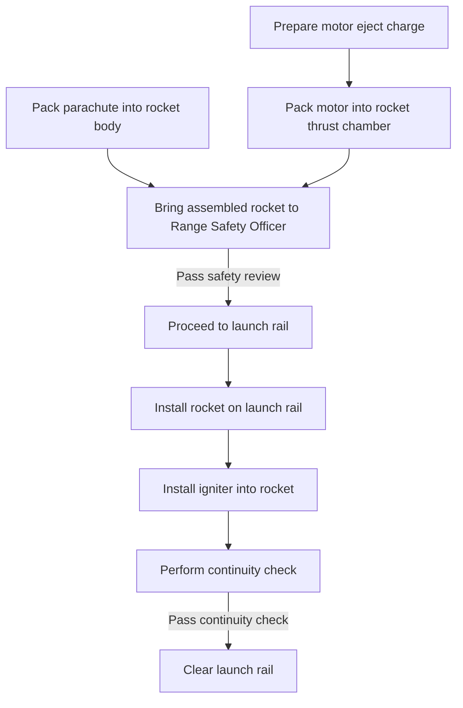

Preflight involves preparing the rocket for flight. There are several steps to this that must be considered for rocket flights.
# Logic diagram

# Entry criteria
## Rocket is fully prepared and only needs final assembly
## Rocket has been fully simulated in OpenRocket and key flight parameters have been determined
xxx
## Rocket has been delivered to launch range
xxx
# Exit criteria
In the final state of this event, the rocket is installed on the rail with an igniter inserted in the motor.
## Rocket passes safety review by Range Safety Officer
The RSO will check the rocket for its key flight parameters and observe the general construction of the rocket.
## Rocket passes continuity check
This is a check made by the launch control system to ensure that there is electrical continuity through the igniter. This is done by passing a high voltage low current signal through the ignition line that is not enough to ignite it. Make sure to look away while this occurs.
# Risk assessment
[[50-System-Trees/dart/4-risks/RISK001 - Poorly installed motor igniter|RISK001 - Poorly installed motor igniter]]
[[50-System-Trees/dart/4-risks/RISK002 - Eye damage during continuity test|RISK002 - Eye damage during continuity test]]
[[50-System-Trees/dart/4-risks/RISK003 - Poor interface to rail|RISK003 - Poor interface to rail]]