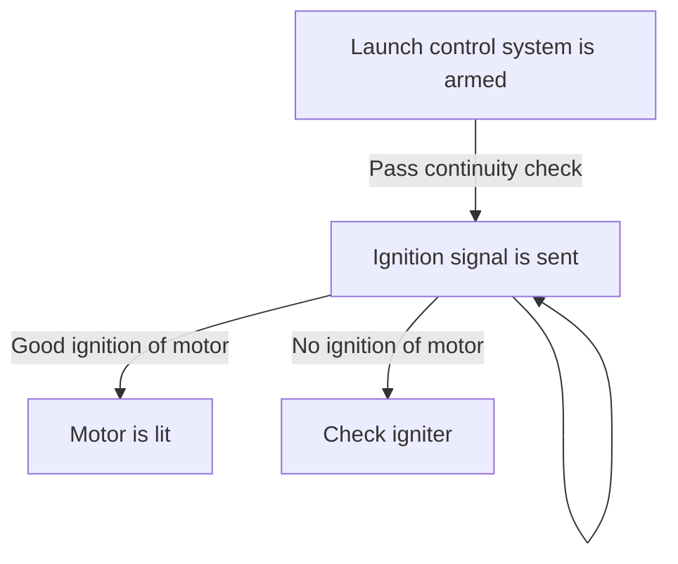

Once a launch window occurs, the RSO will trigger the launch control system to ignite the rocket. Not much to talk about here.
# Logic diagram

# Entry criteria
## Rocket is installed on launch rail
This is the end state of [[50-System-Trees/dart/0-conops/EVENT001 - Preflight|EVENT001 - Preflight]]
## Launch window transpires
This is typically a point where there are minimal clouds above the launch site and where the wind isn't severe. The rocket may also have to wait for other rockets scheduled to fly.
# Exit criteria
In the final state of this event, the rocket motor is lit and the rocket is accelerating upwards.
## Good ignition of motor
Sometimes the motor doesn't light properly, due to a fault in the igniter or poor igniter installation. The RSO may attempt to ignite the motor two or three times, and if theres no ignition then the rocket will have to be checked once the range is clear.
# Risk assessment
